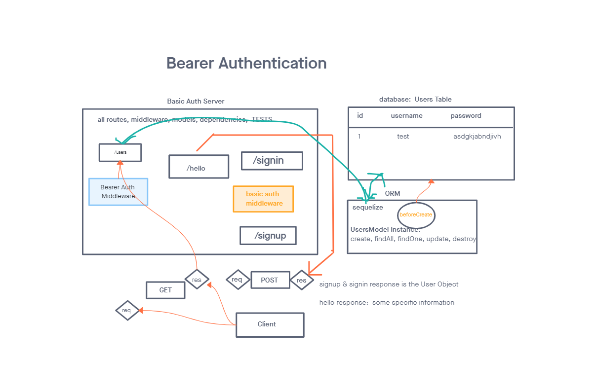

# Lab-07

## Bearer Auth

### Author: Alan Chelko

### Problem Domain

    * In this phase, the new requirement is that any user that has successfully logged in using basic authentication (username and password) is able to continuously authenticate … using a “token”.
    * When a “good” login happens, the user is considered to be “authenticated” and the auth-server generates a JWT signed “Token” which is returned to the application.

### Testing (pre-written)

    * Middleweare (basic auth, bearer auth)
    * Handlers (getSecret, getUsers, signin, signup)
    * Router test

### Setup

    * PORT: 3001

### Deployed server

    * Heroku: [chelko-basic-api-server-prod](https://dashboard.heroku.com/apps/chelko-bearer-auth-prod/)

### Running the app

    * npm start
    * Endpoint: '/signup'
        * POST signup to create an account with username and password (receive token)
    * Endpoint: '/signin'
        * POST to login with existing username and password (receive token)
    * Endpoint: '/users' (with token)
        * Returns existing users
    * Endpoint: '/secret' (wit token)
        * 'Welcome to the secret area!'
    *  Enpoint: '/*'
        * Returns object with 404 error

### Tests

    * npm test

### UML: Basic Auth Server -- Lab 06 UML

